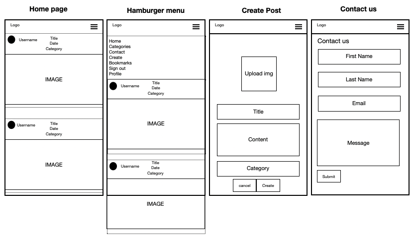

# Dagoy - Content Sharing Platform

Dagoy is a content platform for users to share their content. The concept is that you cannot follow any users, to keep content democracy on a high level and nobody gets to ride on the "high follower number bluff = quality".. What you can do on Dagoy is bookmark posts, filter them by category and also like posts if you appreciate a users content. 

Each user has access to their own profile once they are signed in where they can create posts, see all their bookmarks, edit their profile image and password.

If anyone needs to get in touch with the admin, they can fill out the contact form and the Admin will haveget in touch as soon as possible.

* Deployed FrontEnd - [Dagoy](https://dagoy-pp5.herokuapp.com/)

* Deployed BackEnd API - [Dagoy DRF API](https://pp5-api-bo.herokuapp.com/)

* BackEnd Repo - [LINK](https://github.com/Bo-Lennart/DRF-PP5-API)

* FrontEnd Repo - [LINK](https://github.com/Bo-Lennart/pp5-content-platform)

## Table of Contents
- [User Experience](#user-experience)
    - [Site Goal](#site-goal)
    - [User Stories](#user-stories)
        - [Agile Methodology](#agile-methodology)

- [Design](#design)
    - [Wireframes](#wireframes)
        - [Desktop](#desktop)
        - [Mobile Screen](#mobile-screen)
    - [Color Palette](#color-palette)
    
- [Features](#features)
    - [Foundational Features and components](#foundational-features-and-components)
    - [Components](#components)
    - [Feed Forward - Future Features](#feed-forward---future-features)
    - [C.R.U.D](#crud)
    - [Components](#components)
- [Testing](#testing)
    - [Validators](#validators)
    - [Manual Testing](#manual-testing)
    - [Unfixex Bugs](#unfixed-bugs)

- [Technologies Used](#technologies-used)
    - [Languages](#languages)
    - [Libraries, Frameworks & Programs used](#libraries-frameworks--programs-used)

- [Deployment](#deployment)

- [Credits](#credits)
    - [Content](#content)
    - [Media](#media)

# User Experience
- This content application was built for my Portfolio Project 5 as part of my Diploma in Full-Stack Software Development, Code Institute. 

## Site goal
- The goal of this project is to demonstrate expereience and skills learned throughout the course as a final project within HTML, CSS, JavaScript, React.js and Django REST Framework.

- The application is a content sharing app where users can sign up, inspire eachother with content and upload by category for users to filter their field of interest. 

### User Stories
- The base of this project has consisted of building user stories and plan the project from these.

    1. USER STORY:  As a user I have a navbar to every page so I can navigate easely
    2. USER STORY:  As a user I can sign up for the news page in order to access the features of a signed up user
    3. USER STORY:  As a user I can sign in to the app and access functionality for users
    4. USER STORY:  As a user I can tell if I'm logged in or not so I can log in if I need to
    5. USER STORY:  (Refreshin access tokens) as a user I can maintain my logged in status until I choose to log out so that my experience is not compromised
    6. USER STORY:  As a user I can see booth sign up/sign in options when I'm not signed in
    7. USER STORY:  As a user I can create posts to share my content with images
    8. USER STORY:  As a user I can view other users posts to get inspired in a posts feed list
    9. USER STORY:  As a user I can like other users posts to show that I appreciate their content
    10. USER STORY:  As a user I want to be able to save posts that I find inspiring in order to check them out at a later point
    11. USER STORY:  As a user I can view all the most recent posts to get up to date with topics
    12. USER STORY:  As a user I can switch between categories in order to find the topics that I'm most interested in
    13. USER STORY:  As a user I can edit my own post title, description or category so I can make corrections or updates after they've been created
    14. USER STORY: As a user I can fill out a form to contact Admin and make them aware of issues, feedback or any other matter of contact. 
    15. USER STORY:  As a user I can change my profile picture and change password
    16. USER STORY:  As a user I can update my account password so I can keep my profile secure

### Agile Methodology

- For this project I used GitHubs own KanBan alike agile project method, where I stored my User Stories and could move them from Todo -> In Progress -> Done. This has helped me to know what was next on my list but also keep track of the projects status in terms of where I am. 

* Link To GitHub KanBan Project - [LINK](https://github.com/users/Bo-Lennart/projects/10/views/1)

# Design

For the design of the page i made a basic layout with wireframes and chose four colors as my base. I choose for the buttons to have the standard bootstrap - blue and the rest of the website is based on Bootstraps default design to match my foundational idea. 

# Wireframes

## Desktop

## Mobile Screen

# Color Palette
- I wanted a dark themed navbar, white background for posts and where all content and forms are displayed. Blue buttons to make sure they are not missed and break the dynamic color pattern with some kind of color.

# Features

## Foundational Features and Components
Different components are re-used by other components and nested into each other. For example, the navbar components is reaused on all pages. The post component is re-used to render all posts on bookmark page, profile page, postsfeed etc.
Furthemorethe ProfileIcon component is re-used inside the post component. The MoreDropdown component is used inside the post component and the Edit profile dropdown is re-used in the profile page. It's a complex architecture that works together to supply clear features and navigation for the user to benefit from and increase their experience of the page.

- Navigation Bar 
    - The navbar serves a clear navigation through the application where users can access the diffrent parts of the page. Catogories, bookmarks, contact, their profile, sign in and sign out. The navbar changes, depending on if a user is logged in or not (see screen shot below)
    - Component: 
        - NavBar.js
        - ProfileIcon.js

- Posts Feed
    - The home page of the application is the posts feed. This is where all posts are stored and ordered by the latest post that has been uploaded. 
    - Components: 
        - PostsFeed.js 

- Category feature
    - On the navbar the user has the ability to filter posts on six different categories. These will filter out all posts with the category of choice.
    - Components: 
        - PostBookmarks.js 

- Create post & Contact Form

    - If a user wishes to make a new post, they click on the "create" nav link in the navbar. Furthermore, if they need to contact someone from the admin, they can do so via filling out the contact form that they can find on the navlink "contact".

    - The contact feature is open for all and will be accessible for Admin users through the back-end /admin page.
    - Components: 
        - PostCreateForm.js 
        - ContactForm.js
        - Confirm.js
        - ProfileIcon.js

- Edit posts.
    - When a user scrolls through the feed they will see a pen above their own posts. When they click on this they can delete their posts, or edit them. If they click "edit", they will get redirected to a form, where the data of the post is fetched and the user has the ability to update it accordingly.
    - Components: 
        - MoreDropdown.js 
        - Post.js 
        - PostEditForm.js 
        - PostFeed.js

- Bookmark & Like functionality
    - When clicking in on a post, the user will get redirected to the post details. On this page a like button and bookmark button is displayed.
    Through the like button a user can show their appreciation of a users content. 
    Through the bookmark feature, the user has the ability to store posts to their personal bookmark page. Once it's clicked, this post will be added to the posts that are displayed on your bookmark tab. If the user wishes to remove a bookmark, they just click the icon again.
    - Components: 
        - Post.js
        - PostBookmarks.js

- Edit Profile image & Change password
    - When a user navigates to their own profile, they will see an icon in the upper right corner where they can get to the edit page to change their image or change their password. Please see the screen shots below for this feature.
    - Components: 
        - Profile.js 
        - ProfileEditForm.js
        - UserPasswordForm.js

- Sign in / Sign up

    - For users who are already members of the Dagoy comunity, they can simply sign in to their profile by clicking on the navbar "sign in".

    - For new users, who wish to take part of all features, such as bookmarking posts, liking posts and most of all, make content themselves.. They can create a new user on the "sign up" navlink.
    - Components: 
        - SignInForm.js 
        - SignUpForm.js 

## Feed Forward - Future Features
- Add more categories for the user to pick.
- Add more info to edit for the profile, such as username, location and bio.
- Add more models for the feedback that people send in.
- Implement admin user authentication to render an in site tab where all feedback is stored.

## C.R.U.D

- In terms of C.R.U.D, the app serves a full CRUD feature for posts for the users. They can create, read, update and delete their own posts.
- When it comes to their own profile they can create their profile, edit profile image and change their password. They can see all their posts on their profile page and delete or edit these, from there!
- Furthemore the user has access to the bookmark feature. This list is created for each user, they can read their bookmarks, the page is updated when new bookmarks are added/or deleted.

## Components
1. AxiosDefault.js
2. EditProfileDropdown.js: Edit drop down used for profile page.
3. MoreDropdown.js: Used in every post object but only shown to the owner of a post.
4. NavBar.js: Used on main app to display at the top
5. ProfileIcon.js: Used to display the profile image of users on posts and in navbar

### Pages
1. PostsCategory.js - Depending on what filter is put here, this components will render the desired posts of that specific category.
2. Post.js - The post components, which consists of, and requests all data of a specific post. This is re-used in several other pages.
3. PostEditForm.js - This is the edit form. It fetches the data of the current post and lets the user edit it.
4. PostBookmarks.js - This page re-uses the post.js component, filters through all bookmarks and displays only the current users bookmarks to the page.
5. PostCreateForm.js - This will create new posts and post these to the Data base for other components to get that data from the API when requested. 
6. PostPage.js - This page contains all details of a post, including likes and bookmarks. This is where a user can mark a post as a bookmark to be added to their bokmark page.
7. PostsFeed.js - This page contains all posts that are on the application API.

### Profiles
1. Profile.js
2. ProfileEditForm.js
3. UserPasswordForm.js

# Testing

## Validators

## Manual Testing

## Unfixed Bugs

# Technologies Used

## Modules
- All modules used for this project are documented in the API back-end README. This can be found here: [LINK](https://github.com/Bo-Lennart/DRF-PP5-API)

## Frameworks

## Languages
- HTML5
- CSS3
- JavaScript
- Python (to build the backend)
- JSX
- SQL - Postgres

## Libraries, Frameworks & Programs used
- Django REST Framework - Back-End API
- django - used to build the back-end application
- Font Awesome - Add icons to different navlinks, dropdown menus, bookmark and like buttons.
- Am I resposive? - To see how to front-end page looks on different screen sizes
- React.js - Used to build the architecture of the front-end web application with pages and components. 
- React Bootstrap.js - Provides a library of styling and out of the box components that can contribute to build an optimised UX experience.
- Pages - Used to create wireframes
- GitPod - Workspace IDE.
- GitHub - Repository Hosting.
- Heroku - Platform for final deployment.

# Deploment

# Credits

## Content

- Code Institute: By utilising the Moments walkthrough, step by step of the module of Code Institutes advances front end, I have used this to build a base foundation for my project. However, since I am using a different version of React, I couldn't reuse any code fully. Therefore I have not written any credit comments inside the project, as the re-writing of difference code blocks turned out custom made and gave me the opportunity to refactor into a newer version of react code - in other words: A learning experience. 

- Martina Terlevic: A consistant mentor providing feedback, resources and tips along the way with the project. Structured in her communication and feedback which has allowed me to keep my project in a steady direction. 

- For the README file structure I have been inspired in terms of layout by the following projects:
    - Red Crayon: [LINK](https://github.com/CluelessBiker/project5-red-crayon)
    - Wedding Path: [LINK](https://github.com/cornishcoder1/pp5-react-frontend-the-winding-path)

## Media

- Choco Cookie Post: [LINK](https://pixabay.com/sv/photos/kaka-choklad-chokladkaka-1850011/)
- Asian Buffé Post: [LINK](https://pixabay.com/sv/photos/mat-matr%c3%a4tter-restaurang-m%c3%a5ltid-1050813/)
- B&W Pic of Stockholm Post: [LINK](https://pixabay.com/sv/photos/t%c3%a5g-j%c3%a4rnv%c3%a4g-stad-sverige-stockholm-4184537/)
- Finance Post: [LINK](https://pixabay.com/sv/photos/pengar-vinst-finansiera-f%c3%b6retag-2696228/)
- Test_user_carro Profile Pic: [LINK](https://pixabay.com/sv/photos/kvinna-silhuett-solnedg%c3%a5ng-strand-570883/)
- Music Post: [LINK](https://pixabay.com/sv/photos/kvinna-gitarr-bro-sammantr%c3%a4de-944261/)
- Tech Post: [LINK](https://pixabay.com/sv/photos/software-developer-webbutvecklare-6521720/)
- balinese tradition post: [LINK](https://pixabay.com/sv/photos/dansa-balinesisk-traditionell-4271941/)
- Test_user_form Profile pic: [LINK](https://pixabay.com/sv/photos/flicka-indiska-dansa-r%c3%b6d-1505407/)
- Test_user_form3 Profile pic: [LINK](https://pixabay.com/sv/photos/far-och-son-g%c3%a5ende-j%c3%a4rnv%c3%a4g-grus-2258681/)
- Food Chef ramen Post: [LINK](https://pixabay.com/sv/photos/asiatisk-mat-kock-matlagning-1850233/)